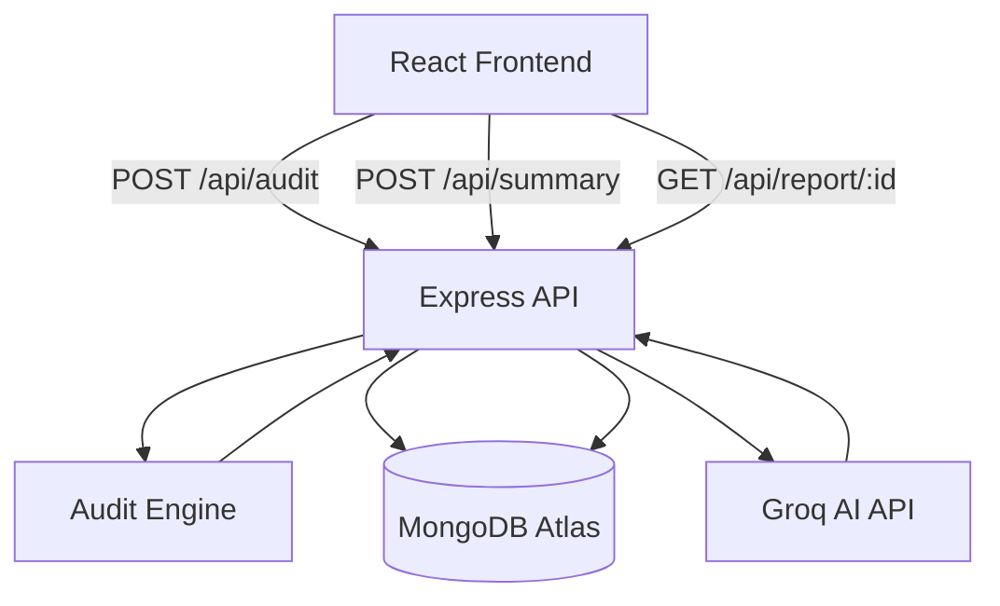

# Architecture

## System Flow Diagram

## Frontend/Backend Flow
1. User enters AI spend data on the React frontend.
2. Frontend sends payload to `POST /api/audit`.
3. Backend calculates savings deterministically and stores report in DB.
4. Backend returns `reportId`.
5. Frontend navigates to report page and requests `POST /api/summary` using the `reportId`.
6. Backend fetches Groq AI summary and updates DB.

## MongoDB Data Flow
- **Reports Collection:** Stores structured data (`monthlySpend`, `recommendations`, `tools`) and the generated AI `summary`.
- **Leads Collection:** Stores user `email` and `company`, linked to the `reportId`. Never exposed to public GET endpoints.

## API Architecture
- **Controllers:** Handle req/res parsing.
- **Services:** Contain business logic (`auditEngine.js`, `aiService.js`).
- **Middleware:** Centralized error handling and rate-limiting.

## Groq Integration Flow
- The backend communicates with Groq via the `groq-sdk`.
- We use a specific prompt injecting the calculated savings metrics.
- Fallback text is generated locally if the Groq API times out to ensure UI resilience.

## Scaling Considerations
- Currently deployed as a single Node instance.
- Rate limiting is implemented to prevent API abuse.
- If scaling is needed, MongoDB indexing on `reportId` supports faster lookups, and the Node app can be horizontally scaled using PM2 or Docker/Kubernetes.
